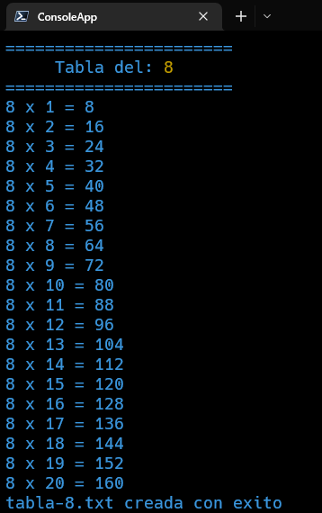

#Notas:

 - Programa en Node basico donde vos podes pedir la tabla de un numero X y declarar la cantidad de veces que quieres multiplicar X.
 - La tabla se muestra en un archivo de texto que se guarda en el directorio 'salida'.
 - Con el argumento '-l' se muestra en consola.


```
Options:
      --help     Show help                                                        [boolean]
      --version  Show version number                                              [boolean]
  -b, --base     Es la base de la tabla de multiplicar                  [number] [required]
  -l, --listar   Despliega la tabla en la consola                [boolean] [default: false]
  -h, --hasta    Cantidad de veces que quieres multiplicar la base   [number] [default: 10]
```

#Tabla desplegada en consola
